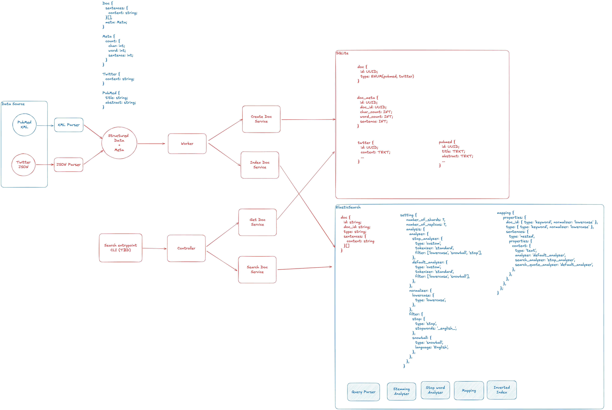

# text-indexing

## Data sources

### Pubmed

Download from [Pubmed](https://ftp.ncbi.nlm.nih.gov/pubmed/baseline/), use `pubmed24n1219.xml.gz` for demo.

Unzip it into `./data-source/pubmed24n1219.xml`

## Temp test

```bash
yarn tsx src/index.ts
```

## Description



The image provides a overview of the system architecture. Let's break it down:

1. Data Sources:
   - Pubmed XML
   - Twitter JSON

2. Parsing:
   - XML Parser for Pubmed
   - JSON Parser for Twitter

   Separate parsers for each data source ensure proper handling of different formats.

3. Structured Data:

   The parsed data is converted into a unified structured format, including fields for Doc, Meta, Twitter, and Pubmed.

4. Worker:

   Processes the structured data, performing tasks such as text normalization, entity extraction, etc.

5. Document Services:
   - Create Doc Service
   - Get Doc Service
   These services handle document creation, and retrieval.

6. Search Services:
   - Search Services
   - Index Doc Service

   Handles search and index requests and interacts with the Elasticsearch component.

7. Elasticsearch:

   The core search engine, with configuration for analyzers, tokenizers, and mapping.

8. Controller:

   Manages incoming search requests from the client.

Potential areas for consideration:

1. Data validation and error handling are not explicitly shown
2. Caching mechanism for frequent searches is not visible
3. No visible load balancing for high traffic scenarios
4. Security measures are not depicted (e.g., authentication, authorization)
5. Monitoring and logging components are not shown

## Folder structure

src/

├── parsers/

│   ├── PubmedParser.ts

│   └── TwitterParser.ts

├── services/

│   ├── CreateDocService.ts

│   ├── IndexDocService.ts

│   ├── GetDocService.ts

│   └── SearchService.ts

├── models/

│   ├── Doc.ts

│   ├── Meta.ts

│   └── StructuredData.ts

├── workers/

│   └── DataProcessor.ts

├── controllers/

│   └── SearchController.ts

├── utils/

│   └── types.ts

├── config/

│   └── elasticsearch.ts

└── index.ts
